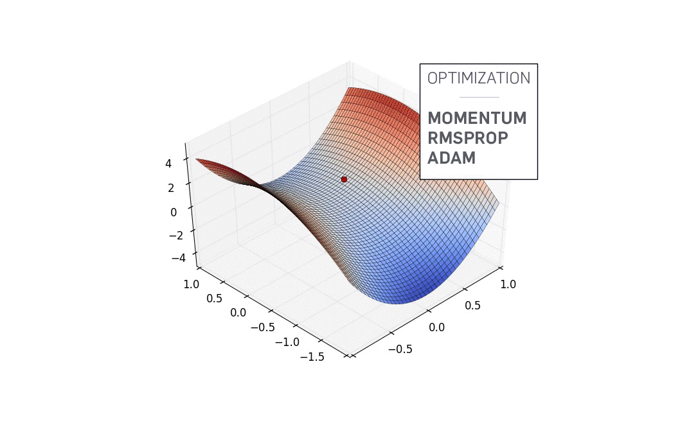

# Optimization Algorithms from Scratch



This repository contains a comprehensive notebook explaining and implementing the optimization algorithms that are commonly used to train machine learning and deep learning models.

Unlike most tutorials that simply rely on existing frameworks such as PyTorch or TensorFlow, this notebook builds every optimizer from first principles. The objective is to understand the mathematics behind each algorithm before using high-level libraries.

The notebook also includes a lightweight automatic differentiation (Autograd) engine implemented from scratch, allowing every optimizer to be tested without relying on external deep learning frameworks.

---

## Contents

### 1. Automatic Differentiation

The notebook begins with the implementation of a minimal reverse-mode automatic differentiation engine capable of:

* Building computational graphs
* Tracking operations between variables
* Computing gradients using backpropagation
* Supporting elementary mathematical operations

This section serves as the foundation for every optimizer implemented later in the notebook.

---

### 2. Loss Functions

The notebook demonstrates gradient computation using a simple regression problem with the Mean Squared Error (MSE) loss.

---

### 3. Optimization Algorithms

Each optimizer is introduced through:

* The motivation behind its creation
* The mathematical formulation
* An intuitive explanation
* A complete implementation from scratch in Python

The implemented optimizers include:

* Gradient Descent (GD)
* Stochastic Gradient Descent (SGD)
* Momentum
* Nesterov Accelerated Gradient (NAG)
* RMSProp
* Adam
* AdaMax
* AMSGrad
* QHAdam
* Yogi

No optimizer relies on external optimization libraries.

---

### 4. Learning Rate Scheduling

The notebook also explores learning rate scheduling techniques that are widely used in modern deep learning.

Implemented schedules include:

* Constant Learning Rate
* Step Decay
* Exponential Decay
* Cosine Annealing
* Linear Warmup
* Warmup + Cosine Annealing

Each schedule is explained mathematically before being implemented.

---

## Educational Goals

This notebook was created to help readers understand:

* How automatic differentiation works internally
* Why optimization algorithms were developed
* The limitations of earlier methods
* How modern optimizers improve convergence
* The role of momentum and adaptive learning rates
* Why learning rate schedules are essential for training deep neural networks

The emphasis is on understanding rather than simply using existing libraries.

---

## Repository Structure

The notebook follows the following progression:

```
Autograd
│
├── Computational Graph
├── Backpropagation
├── Mean Squared Error
│
├── Gradient Descent
├── Stochastic Gradient Descent
├── Momentum
├── Nesterov
├── RMSProp
├── Adam
├── AdaMax
├── AMSGrad
├── QHAdam
├── Yogi
│
└── Learning Rate Scheduling
    ├── Constant
    ├── Step
    ├── Exponential
    ├── Cosine Annealing
    ├── Warmup
    └── Warmup + Cosine
```

---

## Requirements

The notebook only requires a small scientific Python stack:

```text
numpy
matplotlib
```

No machine learning framework is required.

---

## Intended Audience

This notebook is intended for:

* Students learning optimization in machine learning
* Anyone interested in understanding how optimizers work internally
* Readers who want to learn automatic differentiation from scratch
* Developers interested in implementing optimization algorithms themselves

Basic knowledge of calculus, linear algebra, and Python is recommended.

---

## References

The implementations and explanations are based on the original optimization papers and standard deep learning literature, including:

* Gradient Descent
* Stochastic Gradient Descent
* Momentum
* Nesterov Accelerated Gradient
* RMSProp
* Adam
* AdaMax
* AMSGrad
* QHAdam
* Yogi

---

## Disclaimer

This notebook is intended for educational purposes.

The implementations prioritize readability and clarity over computational efficiency. Production deep learning frameworks such as PyTorch and TensorFlow include significantly more optimized implementations designed for large-scale training.

---

## License

This project is released under the MIT License.
